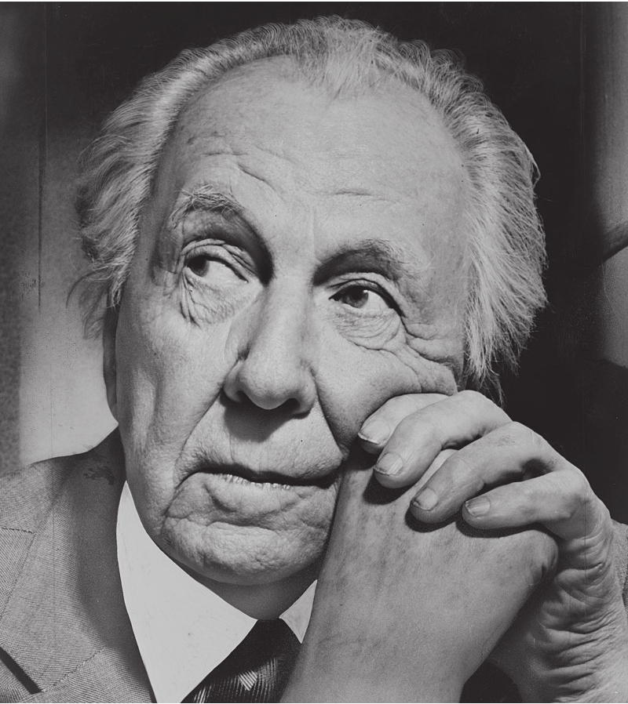

# The Study of Architect Frank Lloyd Wright and Fallingwater

S T U D E N T : D e r r i c k D o u g l a s s , M B A \| C O U R S E : I n t r o t o A r c h + B E \| D A T E
1 6 F E B 2 0 2 3

##  THE STUDY OF ARCHITECT FRANK LLOYD WRIGHT

> 
> "No house should ever be on a hill or on
> anything. It should be of the hill. Belonging to it. Hill and house should live
> together each the happier for the other."

### Introduction

Walk up to any stranger and ask them to name three rock stars, *Beyonce*, *Taylor Swift*, and *Lizzo* would leap from their lips. Next, ask them to
name three architects. You'll see a bit of trepidation in their bodies as they will their brains to think of a response. For the uninitiated,
some guy named _Frank Lloyd_ something rolls off their lips, but no other names are uttered. Ask an architec-ture maven and the names Le
Corbusier, Ghery, and Hadid, and pop out with excitement and fervor.Before they became today's architect rock stars, there was one and they
all called him **Frank Lloyd Wright** (fig1).

Arguably, Frank Lloyd Wright is one of the most important and influential architects of the 20th century. Described by some as
narcissistic, arrogant, a hustler,and a charlatan. 

 (./a55wkhb5.png)
 
>
> "Yours was a prophetic birth"
>          --Anna Lloyd Wright

Paradoxically described by others as confident, a visionary, and a skilled architect. Wright's duality casts
him as an incredibly polarizing figure. Author William Cronin said "Wright cherished his inconsistencies as if they were among his most
beloved creations \[Sic\] (Cronin).

Wright's lasting influence is the re-sult of having designed iconic buildings and residences. The SC Johnson building, NYC's Guggenheim Museum, The Robie
House, and Fallingwater represent some of his best works. His Organic Design philosophy can be experi-enced in his buildings. 
Open floor plans, large, expansive atriums flush with rays of natural light, and unique forms not seen before. In the home, Wright's philosophy
can be felt with its' integration of exterior and interior spaces, open floor plans, hand-built furniture, and home furnishings.

A fearless self-promoter, Wright rou-tinely aggrandized his accomplishments, skill, expertise, and relevance. He routinely ap-peared
on television (the social media of its' day) when it was in its infancy. He wrote books including his autobiography titled "Frank Lloyd Wright:
An autobiography." Additionally, he penned and published articles espousing his design principles for Ladies Home Journal and other
notable magazines.

#### Iconic Frank Lloyd Wright Buildings

1. Taliesin West
2. Robie House
3. [Fallingwater](https://www.fallingwater.org)
4. Guggenheim Museum
5. Marin County Civic Center
6. Jacobs House

####  Early Years

Frank Lloyd Wright was born on June 08th,1867, in Richland Center, Wisconsin to parents Anna Lloyd (neé Jones) Wright (1838/39--1923) and
William Cary Wright (1825--1904) (Daniell, n.d.) (B, n.d.). Two of Wright's four siblings survived infancy and lived into adulthood.
Wright's mother, Anna, played a pivotal steering young Frank toward an architecture career. In a telling of his origin story, Anna proclaimed
Hailing from a large prominent Welsh family, The Lloyd-Jones was a tight-knit clan that espoused education, thrift, and religion. They were Unitarian. 

(./03pbgjwk.png)

Anna doted on her son. She wanted her son to become an architect having placed architectural objects in his crib. Additionally, she gave him a set of Froebel Blocks
to stimulate his creative inclinations (Nash, 2019). Froebel created a series of "playthings" to provide children with focused educational experiences.
Wright would later recount how the blocks helped him understand the concept of space and geometric forms.

William Carey (W.C.), Frank's father, also played a role albeit not as large as An-na's, in Frank's development. William often leaped from job
to job. He worked as a coun-try doctor, politician, lawyer, teacher, church organist, and itinerant preacher (B, n.d.). His love of music and religion influenced 
Frank's design philosophy. Additionally, William was a dreamer, a trait Frank would adopt. Frank's ability to dream big helped him accomplish amazing feats
in the face of insurmountable odds. In 1884, William divorces Ann and leaves the family. Frank despised him for leaving. He later added "Lloyd", his mother's family
surname, to his middle name in an act of maternal loyalty and solidarity. Anna and the Lloyd-Jones family endeavored to send Wright to university though they no longer
had William Carey's financial support.

Wright, aged 18, enrolled at the Uni-versity of Wisconsin in 1886. He majored in Civil Engineering because he couldn't afford to attend
architecture school (Nash, 2019). After two semesters, loaded with confidence and ready to take on the world, Wright left school early and
headed to Chicago, "The City of Big Shoulders." Not surprisingly, it was the closest large city to his beloved mother.

## Architect's Manifesto: Tasks to create a Wright Masterpiece
-[ ] Commune with the Landscape
-[ ] Unify Form and Function
-[ ] Craft with Natural Materials
-[ ] Embrace Geometrical Poetry
-[ ] Blur the Lines

## 5 Famous Clients of Frank Lloyd Wright:

| Client Name             | Profession/Background  | Notable Project(s)           | Significance                                                                                           |
|-------------------------|------------------------|------------------------------|--------------------------------------------------------------------------------------------------------|
| Susan Lawrence Dana     | Publisher              | Unity Temple                 | Influential early commission showcasing Prairie Style philosophy.                                      |
| Darwin D. Martin        | Soap manufacturer      | Martin House Complex         | Extensive commission showcasing Prairie Style evolution and connection to nature.                      |
| Edgar J. Kaufmann Sr.   | Department store owner | Fallingwater                 | Iconic cantilevered house over a waterfall, blurring boundaries between nature and shelter.            |
| Solomon R. Guggenheim   | Art collector          | Solomon R. Guggenheim Museum | Innovative spiral design defying traditional museum layouts.                                           |
| Herbert F. Johnson, Jr. | Businessman            | Johnson Wax Headquarters     | Fusing form and function in an office building with unique features like skylights and research tower. |

## Frank Lloyd Wright's famous buildings as displayed in Python Code
buildings = [
    "Fallingwater, Mill Run, Pennsylvania",
    "Solomon R. Guggenheim Museum, New York City, New York",
    "Robie House, Chicago, Illinois",
    "Taliesin West, Scottsdale, Arizona",
    "Unity Temple, Oak Park, Illinois",
    "Marin County Civic Center, San Rafael, California",
    "Herbert and Katherine Jacobs House, Madison, Wisconsin",
    "Hollyhock House, Los Angeles, California",
    "Imperial Hotel, Tokyo, Japan",
    "Johnson Wax Headquarters, Racine, Wisconsin",
    "Dana-Thomas House, Springfield, Illinois",
    "Pope-Leighey House, McLean, Virginia",
    "Yodokō Guest House, Ashiya, Japan",
    "The Rookery Building, Chicago, Illinois",
    "Willits House, Highland Park, Illinois",
    "Hanna House, Stanford, California",
    "Kentuck Knob, Pennsylvania",
    "Rosenbaum House, Florence, Alabama",
    "The Historic Park Inn Hotel, Mason City, Iowa",
    "Allen House, Wichita, Kansas",
    "Meyer May House, Grand Rapids, Michigan",

# Print the list of buildings
print("Frank Lloyd Wright's Famous Buildings:")
for building in buildings:
    print(building)

# Optionally, you can add functionality to:
   - Filter the list by type (residential, commercial, public)
   - Provide a brief description of each building
   - Link to images or more information about each building

## Works Cited

B, D. (n.d.). William Carey Wright. Retrieved 02 10, 2023, from Find A
Grave: https:// www.findagrave.com/memorial/55462361/william-carey-wright

Com, F. L. (n.d.). About Frank Lloyd Wright. Retrieved 02 04, 2023, from
Frank Lloyd Wright dot Com:
https://franklloydwright.org/frank-lloyd-wright/

Cronin, W. (n.d.). William Cronon's Major Articles. Retrieved 02 20,
2023, from WILLIAM CRONON: https://www.williamcronon.net/articles.html

Daniell, G. (n.d.). Anna Lloyd Jones. Retrieved 02 16, 2023, from
Geni.com: https://www.
geni.com/people/Anna-Lloyd-Jones/6000000003149686384

Frank Lloyd Trust. (n.d.). Wright: Organic Architecture. Retrieved from
Frank Lloyd Trust:
https://www.flwright.org/ckfinder/userfiles/files/Wright-Organic-Architecture.pdf
