> Concept Distillation:

The Study of Architect Frank Lloyd Wright and Fallingwater

> 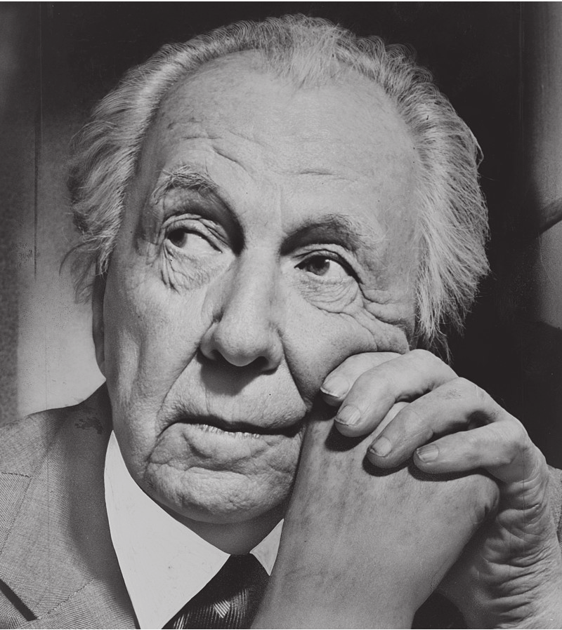{width="7.086613079615048in"
> height="7.9547244094488185in"}S T U D E N T : D e r r i c k D o u g l
> a s s , M B A \| C O U R S E : I n t r o t o A r c h + B E \| D A T E
> : 1 6 F E B 2 0 2 3

2 THE STUDY OF ARCHITECT FRANK LLOYD
WRIGHT{width="1.728510498687664in"
height="0.9154374453193351in"}

> 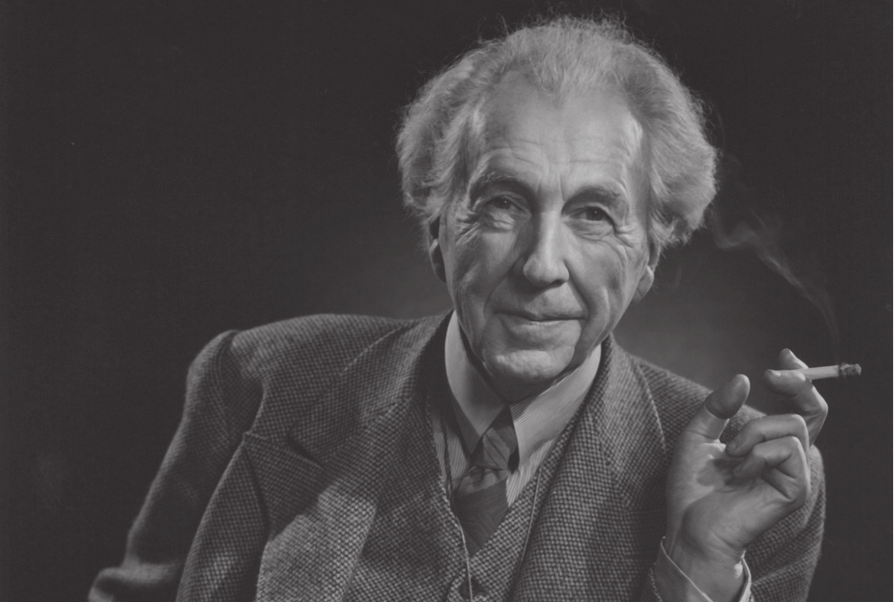{width="4.117891513560805in"
> height="2.765746937882765in"}No house should ever be on a hill or on
> anything.
>
> It should be of the hill. Belonging to it. Hill and house should live
> together each the happier for the other."

{width="1.2968460192475941in"
height="0.7393678915135609in"}The Architect Introduction

Walk up to any stranger and ask them to name three rock stars, Beyonce,
Taylor Swift, and Lizzo would leap from their lips. Next, ask them to
name three architects. You'll see a bit of trepidation in their bodies
as they will their brains to think of a response. For the uninitiated,
some guy named "Frank Lloyd" something rolls off their lips, but no
other names are uttered. Ask an architec-ture maven and the names Le
Corbusier, Ghery, and Hadid, and pop out with excitement and fervor.
Before they became today's architect rock stars, there was one and they
all called him Frank Lloyd Wright (fig1).

Arguably, Frank Lloyd Wright is one of the most important and
influential architects of the 20th century. Described by some as
narcissistic, arrogant, a hustler,

and a charlatan. Paradoxically described by others as

> THE STUDY OF ARCHITECT FRANK LLOYD WRIGHT
> 3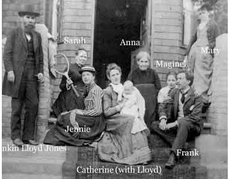{width="3.2989041994750656in"
> height="2.572620297462817in"}
>
> {width="0.9913899825021872in"
> height="0.5693678915135608in"}Yours was a prophetic birth"

confident, a visionary, and a skilled architect. Wright's duality casts
him as an incredibly polarizing figure. Author William Cronin said
"Wright cherished his inconsistencies as if they were among his most
beloved creations \[Sic\] (Cronin).

Wright's lasting influence is the re-sult of having designed iconic
buildings and

residences. The SC Johnson building, NYC's Guggenheim Museum, The Robie
House, and Fallingwater represent some of his best works. His Organic
Design philosophy can be experi-enced in his buildings. Open floor
plans, large, expansive atriums flush with rays of natural light, and
unique forms not seen before. In

the home, Wright's philosophy can be felt with its' integration of
exterior and interior spaces, open floor plans, hand-built furniture,
and home furnishings.

A fearless self-promoter, Wright rou-tinely aggrandized his
accomplishments, skill, expertise, and relevance. He routinely ap-peared
on television (the social media of its' day) when it was in its infancy.
He wrote books including his autobiography titled "Frank Lloyd Wright:
An autobiography." Additionally, he penned and published articles
espousing his design principles for Ladies Home Journal and other
notable magazines.

Early Years

\-- Anna Lloyd Wright

Frank Lloyd Wright was born on June 08th,1867, in Richland Center,
Wisconsin to parents Anna Lloyd (neé Jones) Wright (1838/39--1923) and
William Cary Wright (1825--1904) (Daniell, n.d.) (B, n.d.). Two of
Wright's four siblings survived infancy and lived into adulthood.

Wright's mother, Anna, played a pivotal steering young Frank toward an

> Lloyd Jones Family

architecture career. In a telling of his origin story, Anna proclaimed
"Yours \[Frank Lloyd Wright\] was a prophetic birth." Hailing from a
large prominent Welsh family, The Lloyd-Jones was a tight-knit clan that
espoused education, thrift, and religion. They were

Unitarian. Anna doted on her son. She

> 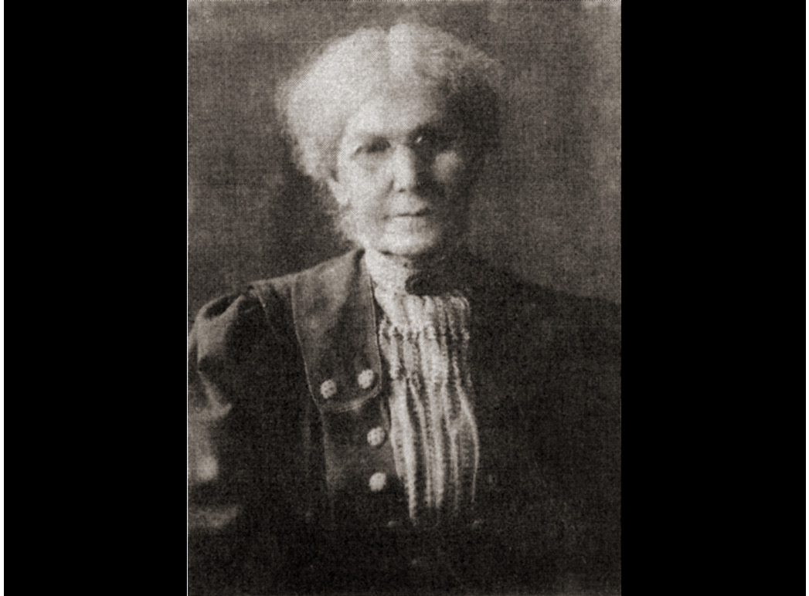{width="3.4878543307086614in"
> height="2.572620297462817in"}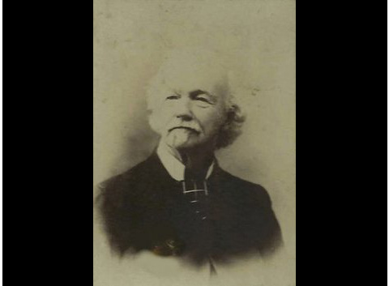{width="3.498180227471566in"
> height="2.572620297462817in"}4 THE STUDY OF ARCHITECT FRANK LLOYD
> WRIGHT
>
> Anna Lloyd Wright

wanted her son to become an architect having placed architectural
objects in his crib. Addi-tionally, she gave him a set of Froebel Blocks
to stimulate his creative inclinations (Nash, 2019). Froebel created a
series of "playthings" to provide children with focused educational
experiences. Wright would later recount how the blocks helped him
understand the concept of space and geometric forms.

William Carey (W.C.), Frank's father, also played a role albeit not as
large as An-na's, in Frank's development. William often leaped from job
to job. He worked as a coun-try doctor, politician, lawyer, teacher,
church organist, and itinerant preacher (B, n.d.). His love of music and
religion influenced Frank's design philosophy. Additionally, William was
a dreamer, a trait Frank would adopt. Frank's ability to dream big
helped him accomplish amazing feats in the face of insurmount-

able odds. In 1884, William divorces Ann and leaves the family. Frank
despised him for leaving. He later added "Lloyd", his mother's family
surname, to his middle name in an act of maternal loyalty and
solidarity. Anna and the

Lloyd-Jones family endeavored to send Wright

> William Carey Wright

to university though they no longer had Wil-liam Carey's financial
support.

Wright, aged 18, enrolled at the Uni-versity of Wisconsin in 1886. He
majored in Civil Engineering because he couldn't afford to attend
architecture school (Nash, 2019). After two semesters, loaded with
confidence and ready to take on the world, Wright left school early and
headed to Chicago, "The City of Big Shoulders." Not surprisingly, it was
the closest large city to his beloved mother.

A Bright Future

Wright's future goals were to become the greatest architect and a
uniquely American ar-chitectural style. Early in his career, he aligned
himself with mentors who taught him the vision and architectural skills
that would help him achieve his goals.

Wright learned impeccable drafting skills during his brief college
tenure. His early diagrams' fidelity and clarity displayed artistic and
technical dexterity. His drafting skills and abundant, youthful
confidence landed him his

first architecture job. In 1886. Wright was hired

> THE STUDY OF ARCHITECT FRANK LLOYD WRIGHT 5

to work at Joseph Lyman Silsbee's firm. Silsbee was a residential
architect for tony, well-to-do clients (Nash, 2019). He was also a new
breed of formally trained architects (Pulfer). Wright worked there
briefly though his newly acquired skills led him to his next employer.
An employer whose influence was integral to Wright's future.

Wright joined Adler & Sullivan in 1887. Louis Sullivan is regarded as
the "Fa-ther of Skyscrapers". Sullivan also coined the phrase "Form
follows Function" (Kauf-man, 1969). Years later Wright amended the
phrase to "A Unity of Form and Func-tion" in keeping with his design
approach (Guggenheim Museum (NYC), n.d.). During this period structural
steel, Carnegie Steel, came to prominence. Sullivan was the first to
master the use of structural steel to move a building's load from its'
skin to an inner skeletal form (Nash, 2019). This technologi-cal
advancement enabled building heights to increase precipitously.
Additionally, this method allowed architects to release pent-

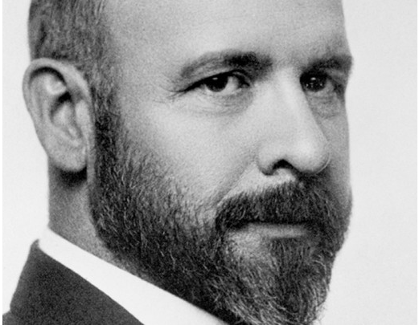{width="3.309469597550306in"
height="2.572620297462817in"}up creativity. They could now design archi-

tectural forms previously unimaginable. The skills Wright acquired under
Sullivan's tute-lage, coupled with emerging building tech-nologies,
helped Wright synthesize numerous disjointed ideas into an articulated
design principle.

Nature and Religion were two princi-ples that articulated Wright
approach to archi-tecture. The documentary titled "Frank Lloyd Wright"
posited that "Wright gets to the divine using nature as the conduit. A
vision of nature that's more than nature" (Lynn Novack, 1998)". The use
of nature is a symbolic means of sub-consciously connecting with the
divine. Wright routinely used unity, harmony, geometry, and other
methods to accomplish his goal.

The ideal of an organic architecture... is a sentient, rational building
that would owe its 'style' to the integrity with which it was
individually fashioned to serve its particular purpose---a 'thinking' as
well as 'feeling' process."

> \-- Frank Lloyd Wright
>
> Design Philosophy
>
> Louis Henry Sullivan
>
> 6 THE STUDY OF ARCHITECT FRANK LLOYD WRIGHT

Organic Architecture is the theory Wright is best known for. He made
valiant attempts to define it but failed to do so in a manner that is
clear and concise. Fortunately, many authors have distilled many of its
principles. Nature, Building, and Site are prominent tenets es-poused in
the Organic Architecture's doctrine (Frank Lloyd Trust).

Wright injects Nature's elements into his buildings; elements that
include proportion, color, sound, pattern, and growth. The ele-ments can
be experienced perceptually. For example, abstract flower forms can be
found in some of his indoor lighting systems. Elements can be
experienced conceptually. Wright's Fallingwater floats over a river
whose sound emanates from below soothing the soul.

The Building and Site combination is another important tenant. Wright's
quote "A grace to the landscape, not a disgrace to it" perfectly
expresses its symbiotic relationship (Lynn Novack, 1998). Wright's
rectilinear Prai-rie Homes with their low-slung hip roofs nestle into
the environment, a mid-western prairie, for which it was designed.

Fallingwater

Introduction

Frank Lloyd Wright was commissioned to build Fallingwater (FW), a
project that would reignite his faltering career and reputation; and
estab-lish him as one of the greatest architects of the 20th century.
And in doing so, he designed an iconic residence many consider one of
the most recognizable private residences ever

built.

Edgar Kauffmann, Sr., President, and owner of Kauffmann's, a regional
depart-ment store chain headquartered in Pitts-burgh, PA, and his wife
Lillian, a socialite, visited Wright's Taliesin West workshop in 1934
(Guerrieri, n.d.) (The Kaufmann Fam-ily, n.d.). The visit was an
opportunity to

visit their son, Edgar Kauffmann, Jr., who was enrolled in a workshop
there. The Kauffmans, an afluent and erudite couple, were familiar with
Wright's work. They ap-proached Wright with a proposal to design a
weekend residence on their property in Bear Run, a tributary in the
Pennsylvania highlands.

Before Wright landed the FW com-mission, he was considered by passe, not
having had any significant commissions for over six years (PHAIDON,
n.d.). Without his Taliesin workshops, his financial situation would
have been in utter dire straits.

Organization

Wright said "Architecture belongs where everybody would have room,
peace, and comfort (Lynn Novack, 1998)." In keeping with his philosophy,
FW's interior spaces are organized in a clustered layout approach.
Clustered layouts were commonly used in residences with relatively small
footprints. this interior layout makes the most sense given FW's form.
Wright's desire to delight FW's users and engaged their senses. Interior
spaces were designed to unfold like a story as users moved through them.
As users move through its servant spaces, it would reveal itself ever so
slowly. Like a gift,

it only reveals its's full self once it is patient-

> THE STUDY OF ARCHITECT FRANK LLOYD WRIGHT
> 7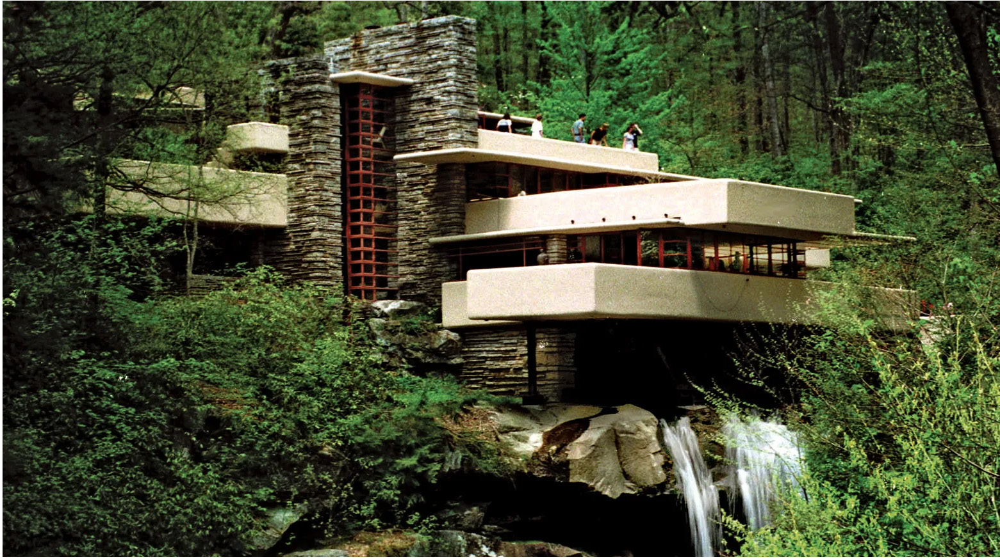{width="6.751272965879265in"
> height="3.7800207786526685in"}

ly unwrapped to reveal what is inside.

Commodity

Before the widespread adoption of residential air conditioning, it was
common for the afluent to build weekend residences to escape hot,
crowded cities. FW was designed and built as a weekend retreat. It is
written that the Kauff-mans enjoyed living there, entertaining guests,
and exploring the site's natural environment.

Firmness

FW has many striking features that it would be a fool's errand to choose
one that defines the residence. The residence's cantilever struc-tures
seem to be the most memorable. "Wright derived the use of cantilevers
from the form

of tree branches or the outstretched human arm (Western Pennsylvania
Conservancy,

n.d.). The cantilevers' fixed end is attached to

the residence's four bolsters. Each bolster is made with
rebar-reinforced concrete and ma-sonry stone (Silman, 2000).

Interestingly, given that Wright only had two semesters of formal study,
there were no-ticeable deficiencies in his approach to struc-tural
design. Many of his buildings are notori-ous for having leaky roofs.
Most would agree that a building's comfort, safety, and mainte-nance
should be paramount in its' design. FW though beautiful, suffered from
quite a few structural issues. The design did not call for enough beams
to support the floors. This led to some floors drooping and weakening
the overall structure. In early 2000, a multimillion-dollar restoration
sought to remedy this and other structural issues.

Like a painter, the litany of disparate building materials in Wright's
materials pal-ette was blended with the sophistication of a master. For
example, each of the residence's

four bolsters was constructed of a steel core

> Fallingwater
>
> 8 THE STUDY OF ARCHITECT FRANK LLOYD
> WRIGHT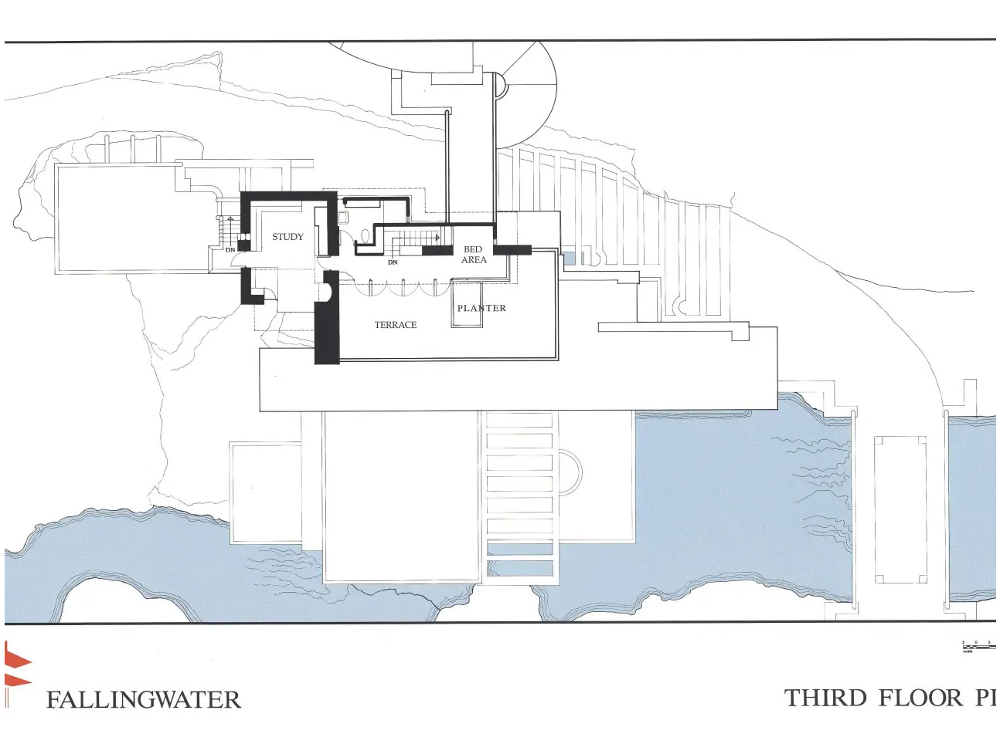{width="3.4905938320209975in"
> height="2.600411198600175in"}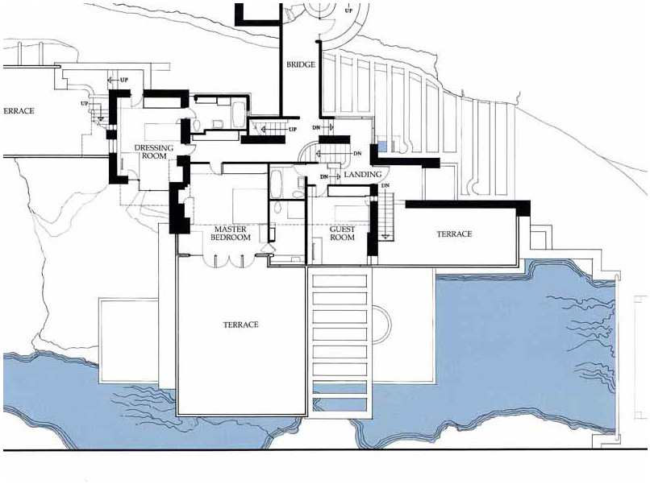{width="3.4935279965004375in"
> height="2.6049748468941383in"}{width="0.1374715660542432in"
> height="11.753904199475066in"}

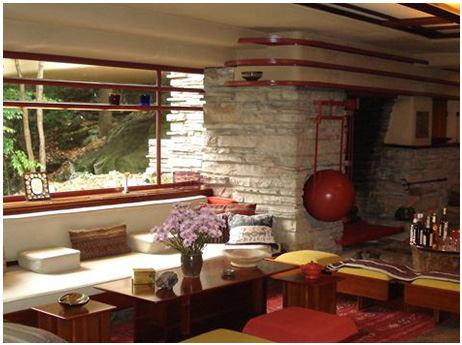{width="3.500521653543307in"
height="2.614025590551181in"}for strength and wrapped in locally
quarried masonry stone for beauty and delight. Struc-tural steel enabled
Wright to design spaces that allowed for greater room head heights.
Though he was late to the game, Wright used poured concrete for
strength. Additionally, it allowed him to create unique forms that would
be dificult to create or expensive if other mate-rials were used.
Lastly, rubber is a constituent material used in the residence's flat
roofs.

Delight

Having visited FW, I believe that the cantile-vers are one of the most
delightful features. another impressive feature is FW's Hearth. Wright
felt that the hearth symbolized fam-

ily. Therefore, he paid particular attention to a hearth's location,
design, and accouterments. FW is no exception.

When entering the family room, the hearth makes its presence known. Its
masonry stones are heavy drawing the eye toward the hearth, the heaviest
visual element in the fam-ily room. Wright also adorned it with one of

the most exquisite cooking pots ever created. Its Asian-inspired muted
red color, its bulbous pregnant-like hooper (evoking fertility and
growth) and its unique handles is pure heaven. It was purported that
Wright recommended that the Kaufman family, boil wine in their hearth
and drink the residue, an ancient roman ritual to increase intellectual
vigor (Kucha).

FW was expressly built for the site it was placed into, a wooded,
stone-laden plot overlooking a stream. It is a perfect meld-

ing of building and landscape and was highly

intentional. The design and site fit into Wright's

> Fallingwater familyroom

Fallingwater Second Floor

> Fallingwater Third Floor
>
> {width="8.282722003499563in"
> height="11.753904199475066in"}THE STUDY OF ARCHITECT FRANK LLOYD
> WRIGHT 9
>
> 10 THE STUDY OF ARCHITECT FRANK LLOYD WRIGHT

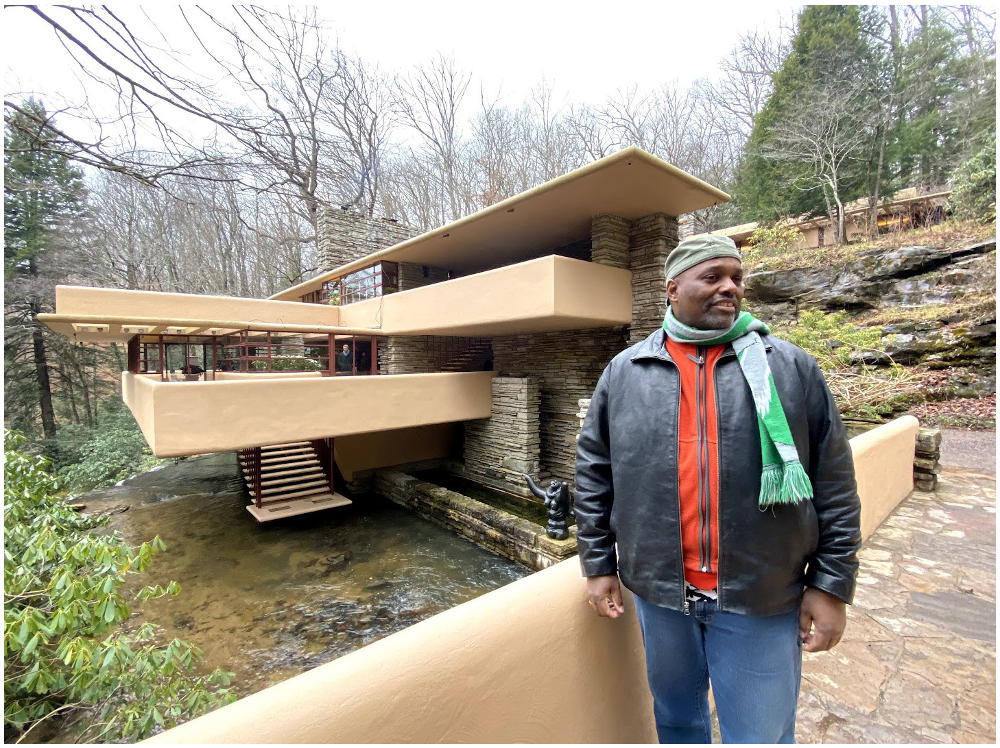{width="3.4740102799650043in"
height="2.6019346019247593in"}desire to bring the outdoors inside.
Natural, neutral muted interior colors were one method to accomplish
this goal. Brown, dark brown, and red were many of the colors selected.
These colors mirror those found on or near the site. Additionally, these
colors were used in selecting furniture, wallpaper, and some cases the
dishes too.

Ordering Principal

FW has a few ordering principles including Da-tum, Axis, and Rhythm. The
rhythm feels like it is the most salient principle. As the eye moves
from top to bottom a strong, regular, repeated pattern of movement is
apparent. The spaces between the cantilevers and their horizontal
orientation contrasted with its bolster's vertical orientation create a
rhythmic and harmonious. Additionally, the building's unusual rhythmic
pattern mimics nature. Trees and branches are the metaphor that comes to
mind.

The Project Experience -

Subjectively:

FW is an evocative and expressive residence. Like many of Wright's
residential designs, the intended experience connects visitors with the
natural world and engages the visitor's sens-es. The building connects
its inner spaces with the bucolic outdoors, a visual delight. "Frank
Lloyd Wright" merges the exterior with the inte-rior creating a seamless
experience." (Kucha). Curtain walls of glass are one method uses

to accomplish this goal. The cantilevers rep-resent tree branches,
another nod to nature.

Wright felt the sound of the stream provided a

> Derrick Douglass

calming, nearly spiritual experience.

I've visited Fallingwater twice. Tran-quility, connectedness, and beauty
can be felt anywhere in the residence. The simple pleasure of first
seeing the majestic property is jaw-dropping, and best experienced in
person. The simple act of discovering the property's hidden main
entrance was de-lightful. The way the furniture was designed and built
for the property gives each space an integrated and connected feeling.

FW is not a perfect residence. Built-in furniture, incredibility small
bedrooms, and a labyrinth-like layout make the user experience a bit
weird. The built-ins are a Wright staple. Unfortunately, this makes FW
feel very inflexible to everyday living. Addi-tionally, Wright's
bedrooms are notoriously small for comfort. Lastly, servant spaces are
serviced by server spaces that are narrow, which makes the
labyrinth-like experience claustrophobic and uncomfortable.

FW is an awesome experience. It deserves its status as one of the finest

residences ever built. Unsurprisingly, a few

> THE STUDY OF ARCHITECT FRANK LLOYD WRIGHT 11

aspects diminish the experience of living or simply visiting the
residence. But I equate FW to a sports car. Fast, beautiful, and sexy,
but expensive and a bit temperamental. It is this attitude that would
help anyone overlook FW's faults.

Vitruvian would probably give FW a grade of B+. FW is incredibly
delightful and fit for purpose, a wonderful weekend residence.
Unfortunately, the passage of time has re-vealed structural design
issues. Issues Vitruvi-an would snicker at since a structurally sound
building is one of his tenets.

"Fallingwater is a great blessing - one of the great blessings to be
experienced here on earth, I think nothing

yet ever equaled the coordination,

sympathetic expression of the great principle of repose where forest and
stream and rock and all the elements of structure are combined so
quietly that you listen not to

any noise whatsoever although the music of the stream is there. But

you listen to Fallingwater the way you listen to the quiet of the
country\..."

> --- Frank Lloyd Wright

12 THE STUDY OF ARCHITECT FRANK LLOYD WRIGHT

Works Cited

> B, D. (n.d.). William Carey Wright. Retrieved 02 10, 2023, from Find A
> Grave: https://

www.findagrave.com/memorial/55462361/william-carey-wright

Com, F. L. (n.d.). About Frank Lloyd Wright. Retrieved 02 04, 2023, from
Frank Lloyd Wright dot Com:
https://franklloydwright.org/frank-lloyd-wright/

Cronin, W. (n.d.). William Cronon's Major Articles. Retrieved 02 20,
2023, from WILLIAM CRONON: https://www.williamcronon.net/articles.html

Daniell, G. (n.d.). Anna Lloyd Jones. Retrieved 02 16, 2023, from
Geni.com: https://www.
geni.com/people/Anna-Lloyd-Jones/6000000003149686384

Frank Lloyd Trust. (n.d.). Wright: Organic Architecture. Retrieved from
Frank Lloyd Trust:
https://www.flwright.org/ckfinder/userfiles/files/Wright-Organic-Architecture.pdf

Guerrieri, V. (n.d.). Kaufmann's, Pittsburgh, and the End of an Era.
Retrieved 02 15, 2023, from Belt Magazine:
https://beltmag.com/kaufmanns-pittsburgh-and-the-end-of-an-era

Guggenheim Museum (NYC). (n.d.). Form Follows Function. Retrieved 02 03,
2023, from guggenheim.org:
https://www.guggenheim.org/teaching-materials/the-architecture-of-the-solomon-r-guggenheim-museum/form-follows-function

Hawk, R. (n.d.). Anna Lloyd Jones Wright. Retrieved 02 12, 2023, from
Find a Grave:
https://www.findagrave.com/memorial/40756071/anna-lloyd-wright

> Hoffman, D. (1996). Frank Lloyd Wright's Dana House. Berlin: Dover
> Publications, Inc. Kaufman, M. D. (1969). Father of Skyscrapers: A
> Biography of Louis Sullivan. Boston:

Little, Brown and Company.

Kucha, P. (n.d.). Frank Lloyd Wright and Ralph Waldo Emerson:
Architecture and lit-erature unite in search of meaning. Retrieved 02
03, 2023, from https://www.youtube.com/ watch?v=8wi-9IqrMJE&t=418s

> Lynn Novack, K. B. (Director). (1998). Frank Lloyd Wright \[Motion
> Picture\]. Nash, P. (2019). Frank Lloyd Wright: Force of Nature.
> Broomall: Mason Crest.

PHAIDON. (n.d.). Frank Lloyd Wright's Fallingwater explained. Retrieved
02 15, 2023, from PHAIDON:
https://www.phaidon.com/agenda/architecture/articles/2016/june/08/frank-lloyd-wrights-fallingwater-explained

Pulfer, D. R. (n.d.). SCHOOL OF ARCHITECTURE - THESES. Retrieved 02 12,
2023, from Syracuse University: https://surface.syr.edu/arc_etd/7/

Service, N. P. (n.d.). NHLs Associated with Frank Lloyd Wright.
Retrieved 02 17, 2023, from National Park Service:
https://www.nps.gov/subjects/nationalhistoriclandmarks/nhls-asso-ciated-with-flw.htm

Silman, R. (2000, September). The Plan to Save Fallingwater. Retrieved
02 15, 2003, from Fallingwater:
https://fallingwater.org/wp-content/uploads/2018/08/2000-Scientific-Ameri-can.pdf

The Kaufmann Family. (n.d.). Retrieved 02 17, 2023, from
fallingwater.org:
https://falling-water.org/history/about-fallingwater/the-kaufmann-family/

> UNESCO. (n.d.). The 20th-Century Architecture of Frank Lloyd Wright.
> Retrieved 02 17,
>
> THE STUDY OF ARCHITECT FRANK LLOYD WRIGHT 13
>
> 2023, from whc.unesco.org: whc.unesco.org

United States Library of Congress. (1954, January 01). Picture of
Architect Frank Lloyd Wright. Picture of Architect Frank Lloyd Wright.
Washington, District of Columbia: United States Library of Congress.
Retrieved 02 20, 2023, from https://en.wikipedia.org/wiki/Frank_Lloyd\_
Wright#/File:Frank_Lloyd_Wright_portrait.jpg

unknown. (n.d.). Fallingwater House. Retrieved 02 15, 2023, from
Wikiarquitectura:
https://en.wikiarquitectura.com/building/fallingwater-house/

Western Pennsylvania Conservancy. (n.d.). BACKGROUND ON FALLINGWATER'S
STRUCTURE. Retrieved 02 15, 2023, from Fallingwater:
http://www.fallingwater.org

Wright, F. L. (1975). In the Cause of Architecture: Essays by Frank
Lloyd Wright for the Architectural Record. (F. Gutheim, Ed.) page
unavailable. Retrieved 02 12, 2023
